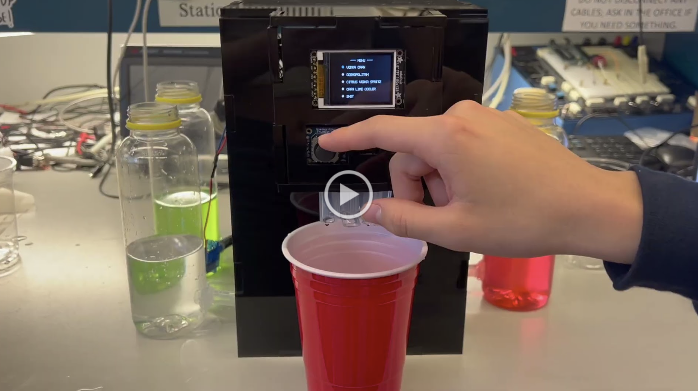

# ESE 3500 Final Project

    * Team Name: PRIME Hydration
    * Team Members: Karen Li, Quinn Liu
    * Github Repository URL: https://github.com/ese3500/final-project-prime-hydration
    * Github Pages Website URL: https://ese3500.github.io/final-project-prime-hydration/
    * Description of hardware: ATmega328PB

## Final Project Report

### 1. Video

### 2. Images

### 3. Results

The final solution to our problem of automatic drink mixing is a fully enclosed machine controlled via an ATmega328PB microcontroller, featuring an LCD screen interface, controlled via a joystick and buttons. The device accurately dispenses different liquids via DC pumps through timing with overflow interrupts and utilizes PWM to control the speed of the DC motor for mixing. While the dispensing accuracy fell slightly short of the targeted +/- 0.2 oz, the overall functionality met the project requirements.

#### 3.1 Software Requirements Specification (SRS) Results

SRS 01 - User interface shall use an LCD graphics library to render each screen within 3 seconds. The interface shall be intuitive and simple such that users naturally navigate through which drink to make without any exterior feedback necessary.

- We achieved this software requirement by implementing a simple 2-menu interface. One for the menu and another for the drink dispensing itself. This resulted in a simple, intuitive, and responsive interface for users that rendered within 1 second each, with a transition time of around 2 seconds.

SRS 02 - User interface shall be controlled via a joystick that utilizes ADC with a resolution of at least 8 bits. The joystick shall be responsive in both the x and y directions for adjusting the strength and selected drink, respectively.

- We achieved this software requirement and were able to navigate through the user interface via a joystick, using both the x and y directions, configured with ADC.

SRS 03 - Program shall accurately control the dispensing of different liquids through timing with overflow interrupts such that each ingredient is dispensed in under 3 seconds and to within +/- 0.2 oz of the specified volume amount.

- We were able to achieve the dispensing of liquids but failed to reach the desired accuracy of +/- 0.2 oz. The real margin of error fell at around +/- 0.4 oz.

SRS 04 - Program shall utilize PWM to control the speed of the DC motor. 

- We were able to generate phase correct PWM using Timer0 to fine tune the desired speed for our DC motor mixer.

#### 3.2 Hardware Requirements Specification (HRS) Results

HRS 01 - Project shall be controlled by an ATmega328PB microcontroller.

- The project is entirely orchestrated using a single ATmega328PB.

HRS 02 - Project shall be powered via a 12V power supply from a wall outlet connection, compatible with the microcontroller.

- The project's external DC pumps were all powered via the 12V power supply, with each DC motor and pump wired with a MOSFET, diode, and resistor circuit.

HRS 03 - DC brushless pumps shall be used for accurate and consistent fluid dispension. Each ingredient shall be dispensed in under 3 seconds and to within +/- 0.2 oz of the specified volume amount.

- The DC pumps did provide consistent fluid dispension but as reported above, accounted for an accuracy of +/- 0.4 oz.

HRS 04 - An 5.5 by 3.5 cm LCD display shall be used for user interface. The display shall communicate with the microcontroller via pin connections.

- The 5.5 by 3.5 cm LCD was able to display all necessary information, including a menu of drinks, drink ingredients, and drink strength.

HRS 05 - A joystick and buttons shall serve as the input components to control the user interface. The joystick shall be used in the y direction to navigate the drink menu and used in the x direction to adjust the drink strength. The first button shall be used for drink selection and the second button shall be used to control the mixing motor.

- All inputs were able to perform their intended duties.

HRS 06 - A DC motor shall serve as a tool for users to mix drinks. The motor shall incorporate the drink such that ingredients are no longer visually distinguishable from each other.

- The mixing apparatus (platic fork) attached to the DC motor was able to properly mix the ingredients of the beverage.

HRS 07 - The physical enclosure should house the wiring and components in a compact and aesthetic manner. The overall device should not exceed 30 x 30 x 30 cm large.

- The housing for the system, not including the external bottles, was 26 x 18 x 20 cm.

HRS 08 - Bottles openings should be accessible for users to easily change and refill ingredient contents.

- Bottles featured a twist off cap that allows for easy refilling.

HRS 09 - The system shall be fully waterproof with fluids unable to come in contact with electronics.

- The interior of the system was fully waterproof. The liquid storage system using the bottles, however, was not fully waterproof and experienced some leakage.

HRS 10 - An ultrasonic sensor should detect liquid level for increased precision of liquid dispension. 

- This feature was not implemented.

### 4. Conclusion

Reflecting on our project, we successfully integrated hardware and software components to create a functional automated drink mixer, while learning some valuable lessons throughout its development. We are proud of achieving core goals such as intuitive user interface design, fast fluid dispensing, and compact hardware enclosure. However, we encountered some challenges, particularly regarding achieving precise liquid dispensing within the specified tolerances. Despite this, we were able to deliver a working prototype that fulfilled most of the initial project SRS and HRS specifications. While our approach remained relatively consistent throughout the project, more exhaustive testing could have been beneficial to address accuracy issues. Moving forward, potential next steps for this project could include integrating additional sensors for better liquid level detection, and addressing any identified issues to improve the overall user experience.

## Final Project Proposal

### 1. Abstract

Our final project is an automated alcoholic and non-alcoholic drink mixer meant to take the hassle out of creating fun drinks for you and your friends. This machine will feature an LCD screen to display a custom user interface where users can select which drinks they want to be made, a joystick/button to navigate the user interface, motors to handle the dispensing and mixing of liquids, and lastly an ID scanner (or breathalyzer) to ensure legal consumption. All of these features are meant to take the hassle out of preparing beverages for themselves or guests, and let them "set and forget" their drink menu.  

### 2. Motivation

When hosting social events, preparing to serve guests beverages can be a deceptively daunting task. What do people want to drink? What ingredients do each of the drinks need? How much of each ingredient do I need to buy? How can I make sure that I'm following the law and only serving those over 21? And lastly, how does one make those drinks? Who will make drinks for our guests and when? Our project will hope to answer all these questions by distilling all these questions down to two. What ingredients do I need to buy, and when do I need to refill? This project is intersting because not only does it solve a real-world problem with a tangible solution, but it will feature modularity that will allow users to customize the solution to their own needs.

### 3. Goals

Core Goals:

1. Have a consistent, controlled, and accurate fluid-dispensing system.

2. Create a user interface that is simple, clean, and intuitive.

3. Design an exterior that allows for easy user entry and replacement of liquids.

4. Find a good balance between speed and precision when making drinks.

Reach Goals:

5. Implement variable mixing speeds depending on the beverage.

6. If the ID scanner is implemented, then implement a breathalyzer, or vice versa.

7. Program different presets, where users can select which set of drinks the machine can make.

8. Allow the user to create custom drink recipes with preset ingredients to be dispensed.

9. Use a distance sensor to sense whether a cup has been placed in the correct position to allow liquid to flow.

10. Monitor the levels of each ingredient supply and alert the user when it is necessary to replace a certain liquid.

11. Create a mobile interface to wirelessly control the device.

### 4. Software Requirements Specification (SRS)

#### Overview

The software requirements for the automated drink mixer include implementing a user-friendly LCD interface with rapid screen rendering for intuitive drink selection, alongside precise control algorithms ensuring accurate dispensing of ingredients within a specified volume range.

#### Users

The primary users include individuals or groups who frequently host social events or gatherings where beverages are served without licensed bartenders.

#### Functionality

SRS 01 - User interface shall use an LCD graphics library to render each screen within 3 seconds. The interface shall be intuitive and simple such that users naturally navigate through which drink to make without any exterior feedback necessary.

SRS 02 - User interface shall be controlled via a joystick that utilizes ADC with a resolution of at least 8 bits. The joystick shall be responsive in both the x and y directions for adjusting the strength and selected drink, respectively.

SRS 03 - Program shall accurately control the dispensing of different liquids through timing with overflow interrupts such that each ingredient is dispensed in under 3 seconds and to within +/- 0.2 oz of the specified volume amount.

SRS 04 - Program shall utilize PWM to control the speed of the DC motor. 

### 5. Hardware Requirements Specification (HRS)

#### Overview

The hardware requirements entail integrating an ATmega328PB microcontroller for central control, coupled with DC brushless pumps and a DC motor for accurate liquid dispensing and mixing. The wiring and tubing will all be housed within a compact, aesthetically pleasing enclosure featuring a LCD display and input components such as a joystick and buttons.

#### Functionality
HRS 01 - Project shall be controlled by an ATmega328PB microcontroller.

HRS 02 - Project shall be powered via a 12V power supply from a wall outlet connection, compatible with the microcontroller.

HRS 03 - DC brushless pumps shall be used for accurate and consistent fluid dispension. Each ingredient shall be dispensed in under 3 seconds and to within +/- 0.2 oz of the specified volume amount.

HRS 04 - An 5.5 by 3.5 cm LCD display shall be used for user interface. The display shall communicate with the microcontroller via pin connections.

HRS 05 - A joystick and buttons shall serve as the input components to control the user interface. The joystick shall be used in the y direction to navigate the drink menu and used in the x direction to adjust the drink strength. The first button shall be used for drink selection and the second button shall be used to control the mixing motor.

HRS 06 - A DC motor shall be controlled via PWM and serve as a tool for users to mix drinks. The motor shall incorporate the drink such that ingredients are no longer visually distinguishable from each other.

HRS 07 - The physical enclosure should house the wiring and components in a compact and aesthetic manner. The overall device should not exceed 30 x 30 x 30 cm large.

HRS 08 - Bottle openings should be accessible for users to easily change and refill ingredient contents. 

HRS 09 - An ultrasonic sensor should detect liquid level for increased precision of liquid dispension. 

### 6. MVP Demo

By the first milestone, we expect to have a machine that depending on user input, can dispense a subset of available liquids at variable and accurate amounts. The LCD screen will display a basic interface and be controlled by an input device such as a joystick.

### 7. Final Demo

By the final demonstration, we expect our project to be able to create a drink with no manual input from the user other than their drink of choice. This means that the device will have a UI that the user can traverse using some form of input hardware, such as a joystick. Once the user has specified which drink they want, the device will then accurately dispense the ingredients for the specific drink into a cup and then mix it. 

### 8. Methodology

We plan to use a systematic and iterative approach to simultaneously develop both software and hardware components.

1. Plan: We will begin by outlining the architecture of the system, including sourcing the appropriate hardware components, designing the user interface layout, and planning the software structure.

2. Hardware Development: Beginning with selecting and sourcing the appropriate components, we will assemble and wire these components. Specific modules will include the interface (LCD screen, joystick), drink dispenser (motor), drink mixer (motor), etc.

3. Software Development: Concurrently, we will develop the corresponding software required for controlling each aspect of the device. Specifically, we will write functions to manage user inputs, sensor readings, drink selection, liquid dispensing, mixign operations, etc.

4. Iteration and Testing: Throughout the process of hardware and software development, we will test isolated modules to ensure correctness before integration.

### 9. Components

LCD Screen - The screen serves as the main user interface, displaying drink options and status updates. It provides visual feedback to users, allowing them to navigate through the drink selection process. 

Joystick (or other input device) - The joystick enables users to interact directly with the interface, selecting drinks and navigating menus.

Motor - The motor will aid in dispensing and mixing liquids in order to maintain accurate control over the flow rate of ingredients. 

Photoresistor - The light sensor detects the presence of a cup in the designated position to prevent spills and inaccuracies.

Ultrasonic Sensor - The distance sensor verifies the amount of liquid in the drink cup and ingredient source containers.

### 10. Evaluation

We believe the success of our device will not just be whether it works, but rather how consistent and easy it is to use. Beyond the SRS and HRS specified above, here is how we would evaluate the different aspects of the project.

Physical Design:

- How compact is it?

- How difficult will it be to refill the different liquids?

- Are the different components placed in logical places?

- Is it visually appealing?

User Interface/Interaction:

- How intuitive is the user interface?

- Is the interface quick and responsive to use (not frustrating)?

- How many steps and different menus will users have to use?

Drink Ingredient Dispensing:

- How accurate is the liquid dispensing system?

- How consistent is the liquid dispensing system?

Drink Mixing:

- How well does the mixing system mix the ingredients together?

General:

- How does the drink taste?

### 11. Timeline

| **Week**            | **Task** | **Assigned To**    |
|----------           |--------- |------------------- |
| Week 1: 3/24 - 3/31 | finalize + order components         |  K + Q                  |
| | create more detailed plan of attack         | K + Q                   |
| | design interface| Karen|
| Week 2: 4/1 - 4/7   | liquid dispension method         |  Karen                  |
| | LCD screen + joystick setup         | Quinn  
| Week 3: 4/8 - 4/14  | mix a basic drink         |   Quinn                 |
| | interactive LCD interface | Karen|
| Week 4: 4/15 - 4/21 | begin 3D printing external parts         |  Quinn |
|  | ID scanner or breathalyzer         |  Karen |
| Week 5: 4/22 - 4/26 | finish up + reach goals         |  K + Q                  |

### 12. Proposal Presentation

[Final Project Proposal slide deck](https://docs.google.com/presentation/d/1vP77EDReYRDI081ij08neSmqsRK1hWU-YOzkya8o6b0/edit#slide=id.g2c64b0c0173_2_0)

## References

LCD Library (Lab 4: Pong)